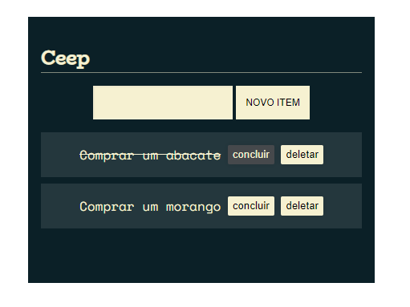

# projeto CEEP
## Made by @jovemcarlosti

Projeto realizado em curso prático de JavaScript na Web: manipule o DOM com JavaScript para o programa Oracle Next Education!

---
### Preview do projeto

Para acessar o projeto CEEP, use o link do Github Pages ou baixe o código para abrir o "index.html"